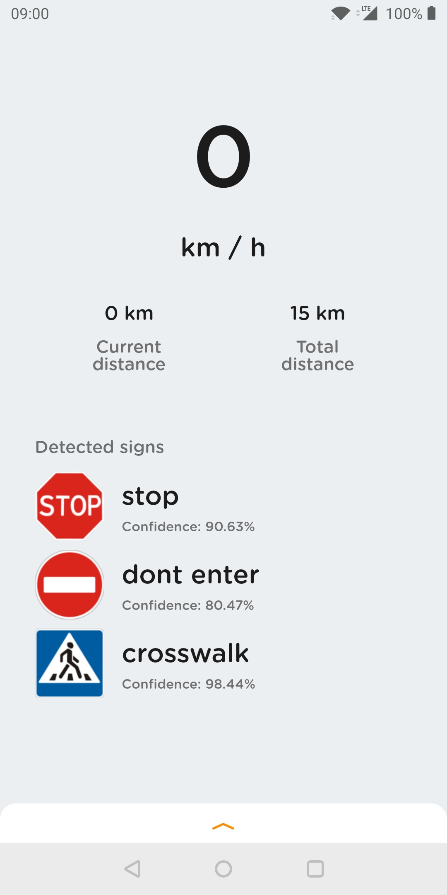

# Traffic Sign Recognition System (TSRS) - Capstone Project

An advanced Android application that uses Real-Time Computer Vision and Deep Learning to detect and classify traffic signs, providing real-time assistance and safety alerts to drivers.

## 🚀 Features

- **Real-time Traffic Sign Detection:** Employs TensorFlow Lite (SSD MobileNet) to identify traffic signs directly from the camera feed.
- **Speed Limit Classification:** Specifically classifies detected speed limit signs and compares them with current vehicle speed.
- **Intelligent Speed Alerts:** Audio and visual warnings when the vehicle exceeds the detected speed limit.
- **GPS Dashboard:** Real-time display of current speed, distance traveled, and GPS satellite status.
- **Sign History Log:** Tracks and logs detected signs with location and timestamp information.
- **Interactive UI:** Dynamic camera overlay for bounding boxes and a persistent bottom sheet for settings and diagnostics.
- **Advanced Configuration:** Adjustable detection confidence thresholds, toggleable voice notifications, and hardware acceleration (NNAPI) support.

## 🛠 Tech Stack

- **Language:** Java
- **Machine Learning:** TensorFlow Lite
- **Dependency Injection:** Dagger 2
- **Reactive Programming:** RxJava 2 & RxAndroid
- **JSON Handling:** Gson
- **Architecture:** Components-based with custom View architectures for real-time overlays.
- **Build System:** Gradle (configured with a root-level application module)

## 🚦 Supported Traffic Signs

The system detects and identifies a wide range of signs:
- **Speed Limits:** 5, 10, 20, 30, 40, 50, 60, 70, 80, 90, 100 km/h.
- **Mandatory & Prohibitory:** Stop, Give Way, No Entry, No Parking, No Overtaking, Dont Stop.
- **Warning:** Crosswalk, Children.
- **Informational:** Main Road.

## 📂 Project Structure

- `java/com/carassistant/tflite`: Contains model wrappers (`TFLiteObjectDetectionAPIModel`) and tracking logic (`MultiBoxTracker`).
- `java/com/carassistant/ui`: UI components, including `DetectorActivity` for the main camera loop.
- `java/com/carassistant/di`: Dagger modules and components for app-wide dependency management.
- `assets/`: Pre-trained models (`detect.tflite`) and label mapping.
- `res/`: User interface resources, layouts, and notification audio files.

## ⚙️ Getting Started

### Prerequisites
- Android Studio Koala (or higher)
- Android SDK 24 (Nougat) or higher
- A physical Android device with a camera and GPS support.

### Installation
1. Clone the repository:
   ```bash
   git clone https://github.com/Veershah696/Traffic-Sign-Recognition-System-TSRS-Capstone-Project.git
   ```
2. Open the project folder in **Android Studio**.
3. Allow Gradle to sync and download dependencies.
4. Deploy the application to your connected Android device.

## 📸 Screenshots

| Detection & Overlay | Sign History | Settings Dashboard |
|---|---|---|
|  |  |  |

## 🤝 Contributing

Contributions are welcome! Please open an issue or submit a pull request for any improvements or bug fixes.

## 📄 License

This project is licensed under the MIT License.
